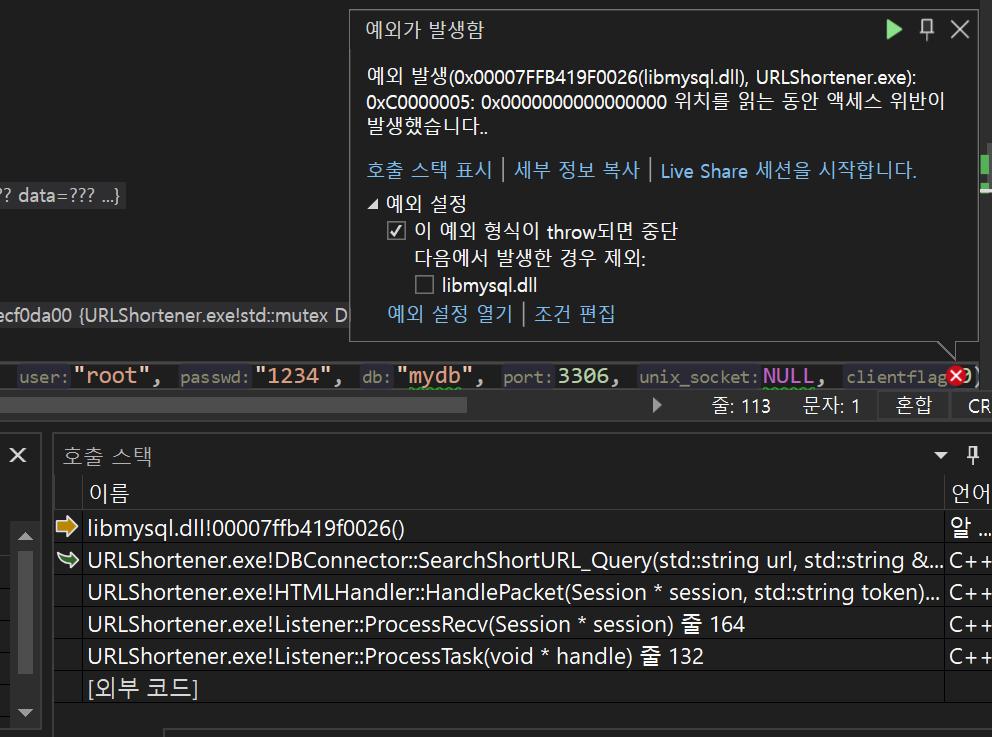
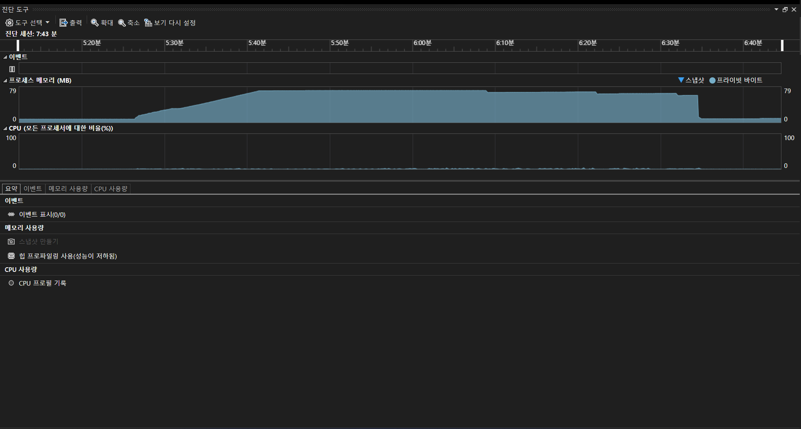

# URL-Shortener
### Update
- 2023년 4월 6일: 실행 가능 하도록 dll 위치 수정

### 개요
- URL $\rightarrow$ 8자리 단축
  - 동일한 URL에 대한, 동일한 단축 결과
- 단축된 URL로 접속시 리다이렉션

- IOCP 모델, 멀티스레드 활용


### 기술 스택
- C++
  - C++20 format 편해보여 사용
  - winsock2 라이브러리
  - 그 외 라이브러리
- MySQL (8.0.31.0)
### 클래스 소개
- Listener([Listener.h](./URLShortener/URLShortener/Listener.h), [Listener.cpp](./URLShortener/URLShortener/Listener.cpp)): 통신 구조 구현, 스레드 
- HTTPParser([HTTPParser.h](./URLShortener/URLShortener/HTTPParser.h),[HTTPParser.cpp](./URLShortener/URLShortener/HTTPParser.cpp)): 패킷이 올바른지(시작 줄만 확인), 필요하 부분 파싱
- HTMLHandler([HTMLHandler.h](./URLShortener/URLShortener/HTMLHandler.h), [HTMLHandler.cpp](./URLShortener/URLShortener/HTMLHandler.cpp)): 요청에 따른 동작 수행(메인 화면, 단축, 리다이렉션), 데이터(html) 전송
- DBConnector([DBConnector.h](./URLShortener/URLShortener/DBConnector.h), [DBConnector.cpp](./URLShortener/URLShortener/DBConnector.cpp)): DB 접근하여 단축url 저장, url 검색
- Rebase64([Rebase64.h](./URLShortener/URLShortener/Rebase64.h), [Rebase64.cpp](./URLShortener/URLShortener/Rebase64.cpp)): 인코딩, 디코딩


### 확인 받고 싶은 부분
1. Listener, DBConnector를 제외한 나머지 클래스 static 함수만 멤버로 갖고 있는데 나쁜 방법인가요?
   - 위와 같이 구현한 이유
     - 비슷한 기능 함수 클래스 단위 관리
     - 메모리 관리 용이(객체 생성 안해도 되서)
  ```cpp
class HTTPParser
{
public:
	static bool IsValid(class Session* session);
	static bool ParsePacket(class Session* session, string& token);
};
```

-----

2. 일반 포인터와 string을 많이 사용했는데 괜찮은 건가요? 더 나은 방법은 뭐가 있을 까요? (shared_ptr 등)
    - ex) 
  ```cpp
  bool HTTPParser::ParsePacket(Session* session, string& token)
  ```
  
  ---
  
  
3. DB에 동시 접근할 때 `mysql_fetch_row()` 함수에서 오류가 생겨 lock을 걸었는데 다른 좋은 방법이 있을 까요?([DBConnector.cpp](./URLShortener/URLShortener/DBConnector.cpp))
 ```cpp
  bool DBConnector::SearchShortURL_Query(string url, string& longURL)
{
    ...
    {
        lock_guard<mutex> guard(dbMutex);
       
        ...
    }
    ...
};
```

---

4. DBConnector 클래스에서 오류가 발생 하는 이유를 모르겠습니다.(dll 관련?)
   - `mysql_real_connect()` 함수 호출 시

        
   - 발생 환경: 서버 구동 후 많은 요청을 바로 받을 때(서버 구동 후 위의 더미클라이언트 실행)
   - 발생 안할 때 환경: 브라우저로 요청 한번 하고 더미 클라이언트 실행
   - 오류 이미지
   - 위치(가장 아래 줄)
  ```cpp
  bool DBConnector::SearchShortURL_Query(string url, string& longURL)
{
    if (Conn == nullptr)
    {
        return false;
    }
    MYSQL* ConnPtr = nullptr;
    MYSQL_RES* Result;
    MYSQL_ROW ROW;
    int Stat;
    {
        lock_guard<mutex> guard(dbMutex);
        
        ConnPtr = mysql_real_connect(Conn, "localhost", "root", "1234", "mydb", 3306, NULL, 0);
        ...
    };
```
### 궁금한 점
- HTTP는 헤더의 크기를 미리 알 수 없어 `\r\n`이 나올 때 까지 읽었는데 맞는 접근인지
- IOCP모델 효과적으로 작동하게 구현하는 법(디자인 패턴?)
- 버퍼 관리하는 효율적인 방법


### 메모리 관리  
  - 더미 클라이언트로 테스트 했을 때, 서버 메모리 점유 상황
	1. 서버 시작
	2. 리다이렉션 요청 (스레드 100개 0.1초 마다 리다이렉션 요청)
	3. 더미 클라이언트 종료

테스트 결과
	1. 처음 보다 메모리가 1MB 증가, 이 상태에서 다시 테스트하면 일정하게 유지
	2. 처리가 지연되지만 작동은 함

### 개선할 점
- TCP는 쪼개져서 오기 때문에 HTTP 패킷이 온전히 도착했는지 확인해야 한다.   
  - 지금은 첫번 째 줄만 정확히 왔는지 확인하고 코드 진행([HTTPParser.cpp](./URLShortener/URLShortener/HTTPParser.cpp))

- 리팩토링

- html 개선
-  accept 함수도 IOCP에 맞게 변경
   - 현재는 recv send만 IOCP 모델에 맞는 함수
